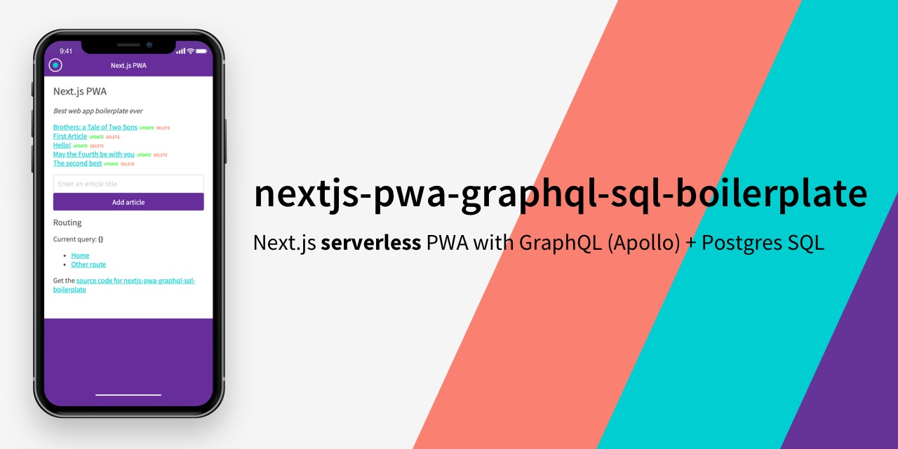
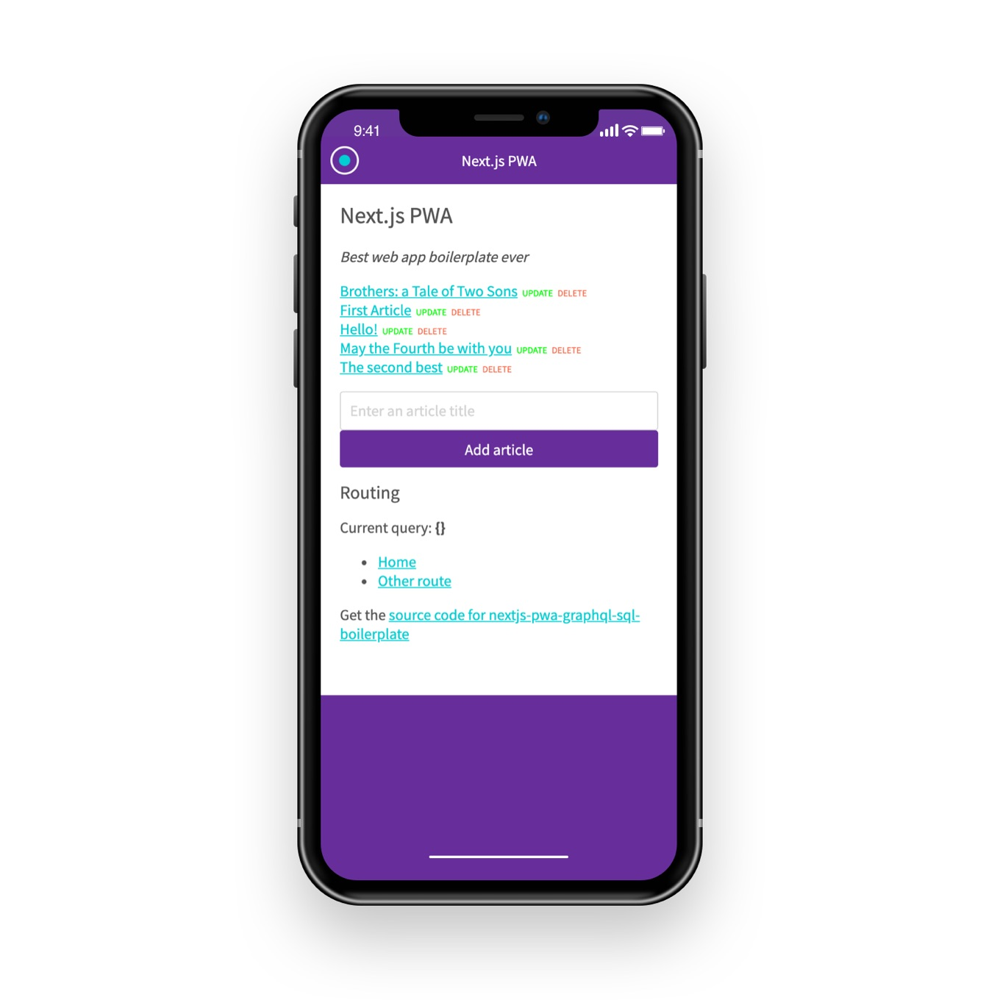

# Next.js serverless PWA with Firebase

_Note: this is my v4 boilerplate for React web apps. See also [nextjs-pwa-graphql-sql-boilerplate](https://github.com/tomsoderlund/nextjs-pwa-graphql-sql-boilerplate), [nextjs-sql-rest-api-boilerplate](https://github.com/tomsoderlund/nextjs-sql-rest-api-boilerplate) and [nextjs-express-mongoose-crudify-boilerplate](https://github.com/tomsoderlund/nextjs-express-mongoose-crudify-boilerplate)._

## Why is this awesome?

This is a great template for a any project where you want **React (with Hooks)** (with server-side rendering, powered by [Next.js](https://github.com/zeit/next.js)) as frontend and **Firebase** as backend.
_Lightning fast, all JavaScript._

* Great starting point for a [PWA (Progressive Web App)](https://en.wikipedia.org/wiki/Progressive_web_applications).
* **NEW: Can be deployed as [serverless functions on Vercel/Zeit Now](#deploying-serverless-on-vercelzeit-now).**
* Firebase as database.
* React Hooks for business logic.
* PWA features such as `manifest.json` and offline support (`next-offline`).
* Easy to style the visual theme using CSS (e.g. using [Design Profile Generator](https://tomsoderlund.github.io/design-profile-generator/)).
* `sitemap.xml` and `robots.txt` support.
* Google Analytics and `google-site-verification` support (see `config/config.js`).
* Flexible configuration with `config/config.js` and `.env` file.
* Hot reloading with `nodemon`.
* Unit testing with Jasmine (`yarn unit`).
* Code linting and formatting with StandardJS (`yarn lint`/`yarn fix`).

## Demo

See [**nextjs-pwa-firebase-boilerplate** running on Vercel/Zeit Now here](https://nextjs-pwa-firebase-boilerplate.tomsoderlund.vercel.sh/).

## How to use

Clone this repository:

    git clone https://github.com/tomsoderlund/nextjs-pwa-firebase-boilerplate.git [MY_APP]

Remove the .git folder since you want to create a new repository

    rm -rf .git

Install dependencies:

    cd [MY_APP]
    yarn  # or npm install

Set up the database:

Configure the `.env` file.

Start it by doing the following:

    yarn dev  # or 'yarn vercel' to run with Vercel/Zeit Now serverless

In production:

    yarn build
    yarn start

If you navigate to `http://localhost:3004/` you will see a web page with a list of articles (or an empty list if you haven’t added one).

## Deploying serverless (on Vercel/Zeit Now)

Run in development mode with:

    yarn vercel

Deploy to Now with:

    yarn deploy

## Modifying the app to your needs

### Change app name

Do search/replace for "nextjs-pwa-firebase-boilerplate" to something else.

Change name in `public/manifest.json`

### Renaming “Article” to something else

The database item is called “Article”, but you probably want something else in your app.

Rename the files:

    mkdir graphql/{newName}
    mv graphql/article/hooks.js graphql/{newName}/hooks.js
    mv graphql/article/queries.js graphql/{newName}/queries.js
    mv graphql/article/resolvers.js graphql/{newName}/resolvers.js
    mv graphql/article/schema.js graphql/{newName}/schema.js
    rm -r graphql/article
    mkdir -p components/{newName}s
    mv components/articles/ArticleList.js components/{newName}s/{NewName}List.js
    mv components/articles/ArticleListItem.js components/{newName}s/{NewName}ListItem.js
    mv components/articles/ArticleDetails.js components/{newName}s/{NewName}Details.js
    rm -r components/articles
    mkdir pages/{newName}s
    mv "pages/articles/[article].js" "pages/{newName}s/[{newName}].js"
    rm -r pages/articles

Then, do search/replace inside the files for different casing: article, Article, ARTICLE

### Change port number

Do search/replace for "3004" to something else.

### How to remove/replace database

### Change visual theme (CSS)

1. Change colors in `public/manifest.json`
2. Change CSS in `public/app.css`
3. Change font in `PageHead.js`
