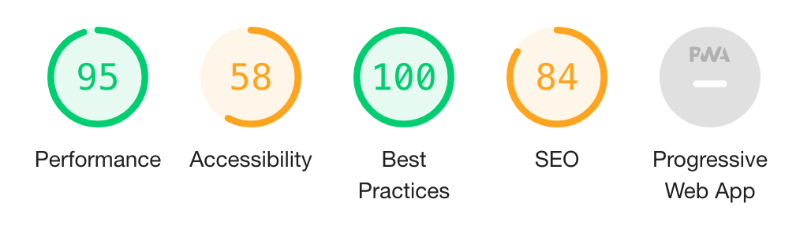

# Next.js PWA Firebase

**Next.js serverless PWA with Firebase and React Hooks**


_Note 1: This boilerplate is being converted to TypeScript. For pure JavaScript, see branch `old-javascript`_

_Note 2: this is my v4 boilerplate for React web apps. See also my [GraphQL + Postgres SQL boilerplate](https://github.com/tomsoderlund/nextjs-pwa-graphql-sql-boilerplate), [Redux + REST + Postgres SQL boilerplate](https://github.com/tomsoderlund/nextjs-sql-rest-api-boilerplate) and [Redux + REST + MongoDB boilerplate](https://github.com/tomsoderlund/nextjs-express-mongoose-crudify-boilerplate). For a simple Next.js landing page, see [nextjs-generic-landing-page](https://github.com/tomsoderlund/nextjs-generic-landing-page)._

## Support this project

Did you or your company find `nextjs-pwa-firebase-boilerplate` useful? Please consider giving a small donation, it helps me spend more time on open-source projects:

[](https://ko-fi.com/tomsoderlund)

## Why is this awesome?

This is a great template for a any project where you want **React (with Hooks)** (with **static site generation (SSG)** or **server-side rendering (SSR)**, powered by [Next.js](https://github.com/zeit/next.js)) as frontend and **Firebase** as backend. *Lightning fast, all JavaScript.*

- Great starting point for a [PWA (Progressive Web App)](https://en.wikipedia.org/wiki/Progressive_web_applications), which you can add to your Home Screen and use as a full-screen app.
- PWA features such as `manifest.json` and offline support (`next-offline`).
- Can be deployed as [serverless functions on Vercel/Zeit Now](#deploying).
- Uses the new Firebase [Firestore](https://firebase.google.com/docs/firestore) database, but easy to replace/remove database.
- Login/Signup with Firebase Authentication.
- Can use SSG `getStaticProps` or SSR `getServerSideProps`.
- React Hooks and Context for state management and business logic.
- Free-form database model. No GraphQL or REST API, just add React Hooks and modify `getStaticProps`/`getServerSideProps` when changing/adding database tables.
- Easy to style the visual theme using CSS (e.g. using [Design Profile Generator](https://tomsoderlund.github.io/design-profile-generator/)).
- SEO support with `sitemap.xml` and `robots.txt`.
- Google Analytics and `google-site-verification` support (see `config/config.js`).
- Flexible configuration with `config/config.js` and `.env.local` file.
- Code linting and formatting with StandardJS (`yarn lint`/`yarn fix`).
- Unit testing with Jasmine (`yarn unit`, not yet included).
- Great page speed, see [Lighthouse](https://developers.google.com/web/tools/lighthouse) score:



## Demo

See [**nextjs-pwa-firebase-boilerplate** running on Vercel here](https://nextjs-pwa-firebase-boilerplate.vercel.app/).


## How to use

Clone this repository:

    git clone https://github.com/tomsoderlund/nextjs-pwa-firebase-boilerplate.git [MY_APP]
    cd [MY_APP]

Remove the `.git` folder since you want to create a new repository

    rm -rf .git

Install dependencies:

    yarn  # or npm install

Start it by doing the following:

    yarn dev

In production:

    yarn build
    yarn start

If you navigate to `http://localhost:3004/` you will see a web page with a list of articles (or an empty list if you haven’t added one).

## Modifying the app to your needs

### Change app name and description

- Do search/replace for the `name`’s “Next.js PWA Firebase”, “nextjs-pwa-firebase-boilerplate” and `description` “Next.js serverless PWA with Firebase and React Hooks” to something else.
- Change the `version` in `package.json` to `0.1.0` or similar.
- Change the `license` in `package.json` to whatever suits your project.

### Renaming “Article” to something else

The main database item is called `Article`, but you probably want something else in your app.

Rename the files:

    git mv hooks/useArticles.js hooks/use{NewName}s.js

    mkdir -p components/{newName}s
    git mv components/articles/CreateArticleForm.js components/{newName}s/Add{NewName}Form.js
    git mv components/articles/ArticleDetails.js components/{newName}s/{NewName}Details.js
    git mv components/articles/ArticleList.js components/{newName}s/{NewName}List.js
    git mv components/articles/ArticleListItem.js components/{newName}s/{NewName}ListItem.js
    rm -r components/articles

    mkdir pages/{newName}s
    git mv "pages/articles/[slug].js" "pages/{newName}s/[slug].js"
    rm -r pages/articles

Then, do search/replace inside the files for different casing: `article`, `Article`, `ARTICLE`.

### Change port number

Do search/replace for `3004` to something else.

### Set up Firebase database (Firestore)

Set up the database (if you don’t need a database, see “How to remove/replace Firebase as database” below):

1. Go to https://console.firebase.google.com/ and create a new project, a new web app, and a new Cloud Firestore database.
2. Copy the `firebaseConfig` (from when setting up the Firebase web app) to `lib/data/firebase.js`
3. Edit the `.env.local` file, setting the `NEXT_PUBLIC_FIREBASE_API_KEY` value.

### How to remove the Firebase dependency

- Run `yarn remove firebase`
- Delete `lib/data/firebase.js` and modify `hooks/useArticles.js`.

### Replace Firebase with Postgres SQL

- Use a Postgres hosting provider (e.g. https://www.elephantsql.com/)
- Use [`createSqlRestRoutesServerless` in `sql-wizard`](https://github.com/tomsoderlund/sql-wizard#creating-rest-routes-serverless-eg-for-nextjs-and-vercel) to set up your own API routes.

### Replace Firebase with Supabase (Postgres SQL, real-time updates)

- Remove Firebase: `yarn remove firebase`
- Add Supabase: `yarn add @supabase/supabase-js`
- Add `NEXT_PUBLIC_SUPABASE_API_KEY` to `.env.local`
- Create a `lib/data/supabase.js`:
```
import { createClient } from '@supabase/supabase-js'
const supabaseUrl = process.env.NEXT_PUBLIC_SUPABASE_URL
const supabaseKey = process.env.NEXT_PUBLIC_SUPABASE_API_KEY
export const supabase = createClient(supabaseUrl, supabaseKey)
```
- Update the JS files that reference `lib/data/firebase`

### Change visual theme (CSS)

1. Change included CSS files in `pages/_app.js`
2. Change CSS in `public/app.css`
3. Change font(s) in `PageHead.js`
4. Change colors in `public/manifest.json`

### Login/Signup with Firebase Authentication

You need to enable Email/Password authentication in https://console.firebase.google.com/project/YOURAPP/authentication/providers

## Deploying on Vercel

> Note: If you set up your project using the Deploy button, you need to clone your own repo instead of this repository.

Setup and deploy your own project using this template with [Vercel](https://vercel.com). All you’ll need is your Firebase Public API Key.

[](https://vercel.com/import/git?s=https%3A%2F%2Fgithub.com%2Ftomsoderlund%2Fnextjs-pwa-firebase-boilerplate&env=NEXT_PUBLIC_FIREBASE_API_KEY&envDescription=Enter%20your%20public%20Firebase%20API%20Key&envLink=https://github.com/tomsoderlund/nextjs-pwa-firebase-boilerplate#deploying-with-vercel)

## Todo

- [x] Optional unique title/description/image for each page (via `_app.js`)
